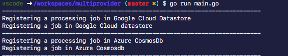

## Multiprovider types and driver pattern PoC

This repository contains a proof of concept to show how to load cloud provider specific drivers at runtime with the aid of parameters.

Inpsired by portable type and driver pattern in [Go cloud cdk](https://github.com/google/go-cloud)

